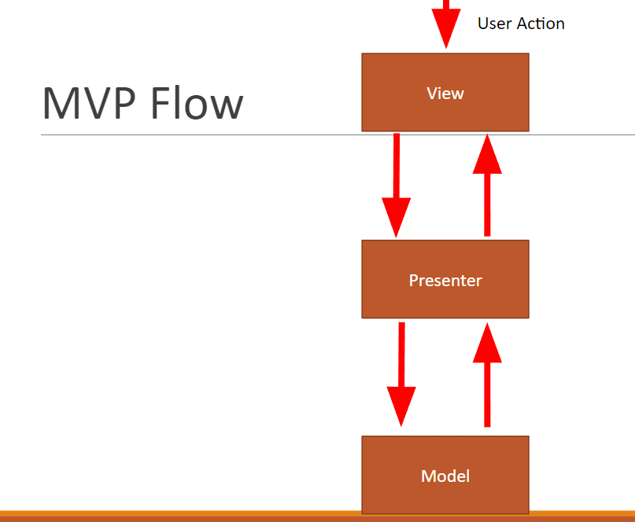

# Android 배달앱 클론 스터디

## 목표
Android로 배달 앱을 클론 하면서 개발하는 방법과 패턴, RxJava등 사용법을 배우게 된다.

## MVP flow



## Base MVP 

### View
화면 단위를 뜻한다. 
Fragment, Adapter, Activity

### Model
데이터 연결 하는 부분을 담당한다. 
Sqlite, Retrofit등

### Presenter
View <-> Model 간의 연결을 도와주는 역할을 한다. 

### Base 작성

#### BaseMvpView

```kotlin
interface BaseMvpView {

    fun getContext(): Context

    fun showError(error: String?)

    fun showError(@StringRes stringResId: Int)

    fun showMessage(@StringRes strResId: Int)

    fun showMessage(message: String)
}
```

#### BaseMvpPresenter

```kotlin
interface BaseMvpPresenter<in V : BaseMvpView> {

    fun attachView(view: V)

    fun detachView()
}
```

#### BaseMvpPresenerImpl
- BaseMvpPresenter를 상속받아서 구현합니다.

```kotlin
open class BaseMvpPresenterImpl<T: BaseMvpView> : BaseMvpPresenter<T> {

    protected var mView: T? = null

    override fun attachView(view: T) {
        mView = view
    }

    override fun detachView() {
        mView = null
    }

}
```

#### BaseMvpActivity

```kotlin
abstract class BaseMvpActivity<in V : BaseMvpView, T : BaseMvpPresenter<V>>
    : AppCompatActivity(), BaseMvpView {

    override fun onCreate(savedInstanceState: Bundle?) {
        super.onCreate(savedInstanceState)
        mPresenter.attachView(this as V)

        title = ""
    }

    override fun getContext(): Context = this

    protected abstract var mPresenter: T

    override fun showError(error: String?) {
        Toast.makeText(this, error, Toast.LENGTH_LONG).show()
    }

    override fun showError(stringResId: Int) {
        Toast.makeText(this, stringResId, Toast.LENGTH_LONG).show()
    }

    override fun showMessage(srtResId: Int) {
        Toast.makeText(this, srtResId, Toast.LENGTH_LONG).show()
    }

    override fun showMessage(message: String) {
        Toast.makeText(this, message, Toast.LENGTH_LONG).show()
    }

    override fun onDestroy() {
        super.onDestroy()
        mPresenter.detachView()
    }
}
```

# 그럼 간단한 앱을 만들어보자. <br/>
 
전체적인 흐름은 다음과 같다. 
1. mvp 코어들을 상속받은 메인 화면을 만든다. 
2. 그안에 버튼을 삽입한다.
3. 버튼클릭시 카운트가 하나씩 올라간다. 
4. 카운트는 View -> Presenter -> Model 로 내려갔다가 반대로 View까지 푸시되어서 화면이 update 되는 과정을 거친다.
5. 카운트는 Firebase 에서 제공해주는 Firestore를 이용한다.

> MVP 코어들을 이용해서 메인 화면을 만든다. <br/>

- MainContract
- MainPresenter
- MainActivity

### MainContract를 만든다. 
- object 클래스는 싱글톤 클래스를 뜻한다.

```kotlin
object MainContract {
    interface View : BaseMvpView {
        fun updateView(count : Int)
    }

    interface Presenter : BaseMvpPresenter<View> {
        fun addCount(count : Int)
    }
}
```

### MainPresenter를 만든다. 
- BaseMvpPresenterImpl를 상속받아서 만드는 걸 유의하자. 
- repository 패턴을 이용한다. 
- addCount 를 통해서 repository.addCount 를 통해서 값을 증가 시킨다. 
- 그리고 repository 를 통해서 값을 가져온다.
    - 일부러 버그 유발 코드를 만들어서 오류를 확인해본다..
- 마지막으로 화면에 업데이트 한다.
    - 지금 구조에서는 값이 실시간으로 파베에 저장이 되고 가져오질 않는다. 
    - 비동기라는 걸 이해하자.

```kotlin
class MainPresenter : BaseMvpPresenterImpl<MainContract.View>(), MainContract.Presenter {

    private val repository : Repository by lazy {
        RepositoryImpl()
    }

    override fun addCount(count: Int) {
        repository.addCount(count)

        val result = repository.getCount()

        mView?.updateView(result)
    }
}
```

### MainActivity를 만든다. 
- BaseMvpActivity 를 상속받는다. 
- MainContract.View 를 상속받아서 updateView를 구현하도록 한다. 
- BaseMvpActivity에서 추상화된 mPresenter 인스턴스를 생성하게끔 한다. 
- 버튼을 클릭시 `mPresenter.addCount(Integer.parseInt(resultTxt.text.toString()))` 를 통해서 presenter로 값을 추가한다.
- `updateView` 를 통해서 View 화면을 업데이트 하도록 한다.


```kotlin
class MainActivity : BaseMvpActivity<MainContract.View, MainContract.Presenter>(), MainContract.View, NavigationView.OnNavigationItemSelectedListener {

    override var mPresenter: MainContract.Presenter = MainPresenter()

    override fun onCreate(savedInstanceState: Bundle?) {
        super.onCreate(savedInstanceState)
        setContentView(R.layout.activity_main)
        setSupportActionBar(toolbar)

        val toggle = ActionBarDrawerToggle(
                this, drawer_layout, toolbar, R.string.navigation_drawer_open, R.string.navigation_drawer_close)
        drawer_layout.addDrawerListener(toggle)
        toggle.syncState()

        nav_view.setNavigationItemSelectedListener(this)

        button.setOnClickListener {
            mPresenter.addCount(Integer.parseInt(resultTxt.text.toString()))
        }
    }

    override fun onBackPressed() {
        if (drawer_layout.isDrawerOpen(GravityCompat.START)) {
            drawer_layout.closeDrawer(GravityCompat.START)
        } else {
            super.onBackPressed()
        }
    }

    override fun onCreateOptionsMenu(menu: Menu): Boolean {
        // Inflate the menu; this adds items to the action bar if it is present.
        menuInflater.inflate(R.menu.main, menu)
        return true
    }

    override fun onOptionsItemSelected(item: MenuItem): Boolean {
        // Handle action bar item clicks here. The action bar will
        // automatically handle clicks on the Home/Up button, so long
        // as you specify a parent activity in AndroidManifest.xml.
        when (item.itemId) {
            R.id.action_settings -> return true
            else -> return super.onOptionsItemSelected(item)
        }
    }

    override fun onNavigationItemSelected(item: MenuItem): Boolean {
        // Handle navigation view item clicks here.
        when (item.itemId) {
            R.id.nav_camera -> {
                // Handle the camera action
            }
            R.id.nav_gallery -> {

            }
            R.id.nav_slideshow -> {

            }
            R.id.nav_manage -> {

            }
            R.id.nav_share -> {

            }
            R.id.nav_send -> {

            }
        }

        drawer_layout.closeDrawer(GravityCompat.START)
        return true
    }

    override fun updateView(count: Int) {
        resultTxt.text = count.toString()
    }
}
```

## Firebase 에 있는 Firestore를 이용해 보자.

1. https://firebase.google.com/ 를 통해서 로그인 후 프로젝트를 만든다.
2. 콘솔로 가서 프로젝트 설정을 통해서 앱 추가를 한다. 
3. 패키지명을 적어주고 google-services.json 파일을 받는다. 
4. 다시 프로젝트로 와서 app 폴더에 방금 받은 파일을 추가해준다. 
5. https://firebase.google.com/docs/android/setup?authuser=0 을 참고해서 dependencies를 추가한다. 
6. firebase-core 를 꼭 추가해주는 걸 잊지 말자.
7. firestore 문서로 가서 android 를 클릭해서 라이버러리를 추가해준다. 
    1. `compile 'com.google.firebase:firebase-firestore:15.0.0` 을 추가 해주는 걸 잊지 말자.

# Model 부분 추가
## Repository 를 추가해보자. 
1. Repository 사용될 함수들 인터페이스 정의
2. RepositoryImpl 구현
3. FirebaseRepository 를 구현

### Repository

```kotlin
interface Repository {

    fun addCount(count: Int)
    fun getCount() : Int

}
```

### RepositoryImpl

```kotlin
class RepositoryImpl : Repository{

    val firebaseRepo : Repository by lazy {
        FirebaseRepository()
    }

    var result = 0

    override fun addCount(count: Int) {
        result = count + 1

        firebaseRepo.addCount(result);

    }

    override fun getCount() : Int {
        return result
    }
}
```

### FirebaseRepository
- map 형태로 넣을 수 있다. 
- 콜백형태로 값을 핸들링 가능핟. 

```kotlin
class FirebaseRepository : Repository{
    val firestoreApp by lazy {
        FirebaseFirestore.getInstance()
    }

    override fun addCount(count: Int) {
        val map = mapOf("value" to count)

        firestoreApp.collection("test").document("count")
        .set(map)
        .addOnSuccessListener {
            Log.d("firebase", "success add with $count")
        }
        .addOnFailureListener{
            Log.d("firebase", "Error adding count")
        }

    }

    override fun getCount() : Int {
        TODO("not implemented") //To change body of created functions use File | Settings | File Templates.
    }
}
```
